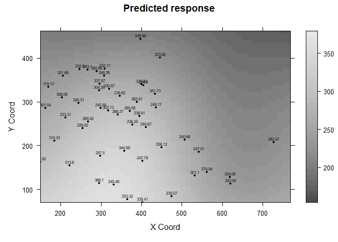

## Spatial Censored Regression Models in R: The `CensSpatial` Package

<div style="text-align: justify">

The `CensSpatial` package allows the analysis of spatial censored
observations. It provides tools for simulation, estimation and
prediction of Gaussian processes with spatially correlated and censored
data. Four estimation procedures can be found within the package, the
Seminaive method proposed in Schelin and Sjöstedt-de Luna (2014), the
stochastic approximation (SAEM) proposed by Ordonez et al. (2018) and
two naive approximations (Naive 1 and Naive 2), which impute censored
observations by using the limit of detection ($LOD$) and $\frac{LOD}{2}$
respectively.

Next, we will illustrate the package functionalities by using the the
rainfall dataset analyzed in Diggle and Ribeiro Jr (2002). Since this
dataset does not contain censored data, we generated it artificially for
the first 100 observations, in this case, we consider a level of
censoring of 25%. The code below, shows this procedure

</div>

``` r
library(geoR)
#> Warning: package 'geoR' was built under R version 4.2.2
#> --------------------------------------------------------------
#>  Analysis of Geostatistical Data
#>  For an Introduction to geoR go to http://www.leg.ufpr.br/geoR
#>  geoR version 1.9-2 (built on 2022-08-09) is now loaded
#> --------------------------------------------------------------
 data(parana)

### training dataset
dataobs = data.frame(parana$coords[1:100,],parana$data[1:100])

#### test dataset 
datapred = data.frame(parana$coords[101:143,],parana$data[101:143])

### manageable names 
names(dataobs) = c('c1','c2','y')
names(datapred) = names(dataobs)

######### generating censored observations ###########

lod = quantile(dataobs$y,probs = 0.25) ### limit of detection (LOD)
dataobs$y[dataobs$y<=lod] = lod
cc = as.numeric(dataobs$y == lod)
dataobs$cc = cc
```

<div style="text-align: justify">

In order to specify the mean and covariance components of the model, we
use some descriptive graphs. Figure 1 depicts the rainfall dataset,
where the left panel shows the average rainfall in each coordinate and
the right panel shows the sample variogram for the observed data
considering a Gaussian covariance structure. From this figure, we can
conclude that it is plausible to assume a linear trend of the rainfall
with respect to its coordinates. The behavior showed in the sample
variogram seems to indicate that it is also plausible to consider a
Gaussian covariance structure for the stochastic component.

</div>

    #> variog: computing omnidirectional variogram
    #> variog: computing omnidirectional variogram


### Estimation and prediction utilities

<div style="text-align: justify">

Now, we proceed to fit the selected model through the available
algorithms within the package. The code below show the sintax for each
method, arguments related to data structure, model specification and
convergence items such as initial values must be specified.

</div>

``` r
library(CensSpatial)
set.seed(123)


### SAEM sintax

SAEMres = SAEMSCL(cc,y,cens.type="left",trend="1st",coords=coords,
               kappa=2, cov.model="gaussian", fix.nugget=F,nugget=170,
               inits.sigmae=68,inits.phi=900, search=T,
               lower=c(0.0001,0.0001),upper=c(50000,5000),
               M=15,perc=0.25,MaxIter=500,pc=0.2)
#>   |                                                                              |                                                                      |   0%  |                                                                              |                                                                      |   1%  |                                                                              |=                                                                     |   1%  |                                                                              |=                                                                     |   2%  |                                                                              |==                                                                    |   2%  |                                                                              |==                                                                    |   3%  |                                                                              |===                                                                   |   4%  |                                                                              |===                                                                   |   5%  |                                                                              |====                                                                  |   5%  |                                                                              |====                                                                  |   6%  |                                                                              |=====                                                                 |   7%  |                                                                              |=====                                                                 |   8%  |                                                                              |======                                                                |   8%  |                                                                              |======                                                                |   9%  |                                                                              |=======                                                               |   9%  |                                                                              |=======                                                               |  10%  |                                                                              |=======                                                               |  11%  |                                                                              |========                                                              |  11%  |                                                                              |========                                                              |  12%  |                                                                              |=========                                                             |  12%  |                                                                              |=========                                                             |  13%  |                                                                              |==========                                                            |  14%  |                                                                              |==========                                                            |  15%  |                                                                              |===========                                                           |  15%  |                                                                              |===========                                                           |  16%  |                                                                              |============                                                          |  17%  |                                                                              |============                                                          |  18%  |                                                                              |=============                                                         |  18%  |                                                                              |=============                                                         |  19%  |                                                                              |==============                                                        |  19%  |                                                                              |==============                                                        |  20%  |                                                                              |==============                                                        |  21%  |                                                                              |===============                                                       |  21%  |                                                                              |===============                                                       |  22%  |                                                                              |================                                                      |  22%  |                                                                              |================                                                      |  23%  |                                                                              |=================                                                     |  24%  |                                                                              |=================                                                     |  25%  |                                                                              |==================                                                    |  25%  |                                                                              |==================                                                    |  26%  |                                                                              |===================                                                   |  27%  |                                                                              |===================                                                   |  28%  |                                                                              |====================                                                  |  28%  |                                                                              |====================                                                  |  29%  |                                                                              |=====================                                                 |  29%  |                                                                              |=====================                                                 |  30%  |                                                                              |=====================                                                 |  31%  |                                                                              |======================                                                |  31%  |                                                                              |======================                                                |  32%  |                                                                              |=======================                                               |  32%  |                                                                              |=======================                                               |  33%  |                                                                              |========================                                              |  34%  |                                                                              |========================                                              |  35%  |                                                                              |=========================                                             |  35%  |                                                                              |=========================                                             |  36%  |                                                                              |==========================                                            |  37%  |                                                                              |==========================                                            |  38%  |                                                                              |===========================                                           |  38%  |                                                                              |===========================                                           |  39%  |                                                                              |============================                                          |  39%  |                                                                              |============================                                          |  40%  |                                                                              |============================                                          |  41%  |                                                                              |=============================                                         |  41%  |                                                                              |=============================                                         |  42%  |                                                                              |==============================                                        |  42%  |                                                                              |==============================                                        |  43%  |                                                                              |===============================                                       |  44%  |                                                                              |===============================                                       |  45%  |                                                                              |================================                                      |  45%  |                                                                              |================================                                      |  46%  |                                                                              |=================================                                     |  47%  |                                                                              |=================================                                     |  48%  |                                                                              |==================================                                    |  48%  |                                                                              |==================================                                    |  49%  |                                                                              |===================================                                   |  49%  |                                                                              |===================================                                   |  50%  |                                                                              |===================================                                   |  51%  |                                                                              |====================================                                  |  51%  |                                                                              |====================================                                  |  52%  |                                                                              |=====================================                                 |  52%  |                                                                              |=====================================                                 |  53%  |                                                                              |======================================                                |  54%  |                                                                              |======================================                                |  55%  |                                                                              |=======================================                               |  55%  |                                                                              |=======================================                               |  56%  |                                                                              |========================================                              |  57%  |                                                                              |========================================                              |  58%  |                                                                              |=========================================                             |  58%  |                                                                              |=========================================                             |  59%  |                                                                              |==========================================                            |  59%  |                                                                              |==========================================                            |  60%  |                                                                              |==========================================                            |  61%  |                                                                              |===========================================                           |  61%  |                                                                              |===========================================                           |  62%  |                                                                              |============================================                          |  62%  |                                                                              |============================================                          |  63%  |                                                                              |=============================================                         |  64%  |                                                                              |=============================================                         |  65%  |                                                                              |==============================================                        |  65%  |                                                                              |==============================================                        |  66%  |                                                                              |===============================================                       |  67%  |                                                                              |===============================================                       |  68%  |                                                                              |================================================                      |  68%  |                                                                              |================================================                      |  69%  |                                                                              |=================================================                     |  69%  |                                                                              |=================================================                     |  70%  |                                                                              |=================================================                     |  71%  |                                                                              |======================================================================| 100%


### Seminaive sintax
seminaiveres = Seminaive(data=dataobs,y.col=3,coords.col=1:2,
                         covar=F,cc=as.matrix(cc),trend="1st",
                         cov.model="gaussian",fix.nugget=F,
                         nugget=170,kappa=2,
                         thetaini=c(700,200),
                         cons=c(0.1,2,0.5),MaxIter=500,
                         copred=coordspred, cutoff = lod)


### Naive 1 and Naive 2 sintax
naive12res = algnaive12(data=dataobs,y.col=3,coords.col=1:2,covar=F,
                        cc=as.matrix(cc),trend="1st",
                        cov.model="gaussian",fix.nugget=F,nugget=170,kappa=2,
                        thetaini=c(700,200),copred=coordspred,
                        cutoff=lod)
```

<div style="text-align: justify">

The function summary allows to print summarized results for each
algorithm. The output below shows the use of this function for the SAEM
algorithm.

</div>

``` r
summary(SAEMres)
#> 
#> Call:
#> summary.SAEMSpatialCens(object = SAEMres)
#> 
#> 
#> 
#> ---------------------------------------------------
#>   Spatial Censored Linear regression with Normal errors (SAEM estimation) 
#> ---------------------------------------------------
#> 
#> *Type of trend: Linear function of its coordinates,
#> 
#> mu = beta0 + beta1*CoordX + beta2*CoordY
#> 
#> *Covariance structure: gaussian
#> ---------
#> Estimates
#> ---------
#> 
#>        Estimated
#> beta 0  362.7686
#> beta 1   -0.0705
#> beta 2   -0.3055
#> sigma2  939.9342
#> phi     219.6152
#> tau2    362.5092
#> 
#> ------------------------
#> Model selection criteria
#> ------------------------
#> 
#>         Loglik     AIC     BIC AICcorr
#> Value -349.592 711.183 726.814 712.087
#> 
#> -------
#> Details
#> -------
#> 
#> Type of censoring = left
#> Convergence reached? = TRUE
#> Iterations = 354 / 500
#> MC sample = 15
#> Cut point = 0.2
```

<div style="text-align: justify">

Since the output of each algorithm is a list, criteria such as the
log-likelihood, the Akaike and Bayesian information (AICand BIC
respectively), can be recovered through the instructions `obj$loglik`,
`obj$AIC` and `obj$BIC`, where obj is an object generated by any of the
available functions for estimation. It can be seen that the SAEM
algorithm shows better results for all the criteria in comparison with
the remaining methods.

</div>

``` r
##### Results #####

saemres = round(c(SAEMres$theta, SAEMres$loglik, SAEMres$AIC, SAEMres$BIC),3)
Seminaiveres = round(c(seminaiveres$theta, seminaiveres$loglik, seminaiveres$AIC, seminaiveres$BIC),3)
naive1res = round(c(naive12res$theta1, naive12res$loglik1, naive12res$AIC1,naive12res$BIC1),3)
naive2res = round(c(naive12res$theta2, naive12res$loglik2, naive12res$AIC2,naive12res$BIC2), 3)


tableres = rbind(Seminaiveres,naive1res,naive2res,saemres )
colnames(tableres) = c(paste0("beta",0:2), "sigma2","phi","tau2","loglik","AIC", "BIC")
rownames(tableres) = c("Seminaive","Naive_1","Naive_2","SAEM (best)")

tableres 
#>               beta0  beta1  beta2   sigma2     phi    tau2   loglik      AIC
#> Seminaive   401.135 -0.132 -0.368  621.682 181.567 807.717 -486.511  985.023
#> Naive_1     354.131 -0.066 -0.232  855.948  82.310 244.582 -438.130  888.260
#> Naive_2     461.964 -0.236 -0.508 2129.897  29.896 453.202 -498.746 1009.491
#> SAEM (best) 362.769 -0.071 -0.306  939.934 219.615 362.509 -349.592  711.183
#>                  BIC
#> Seminaive   1000.654
#> Naive_1      903.891
#> Naive_2     1025.122
#> SAEM (best)  726.814
```

<div style="text-align: justify">

Regarding predictions, `CensSpatial` allows to generate intensity plots
of both predictions and their standard deviations considering the SAEM
algorithm through the function `predgraphics`. As main arguments we can
find `grid1`, which consists of a grid of coordinates to construct the
plot for prediction, `xpred`, which are the covariate values defined for
this grid, `est`, an object of the class `SAEMSpatialCens`, and
`sdgraph`, a logical argument which is `TRUE` by default, providing the
standard deviation of the predictors.

</div>

``` r
coorgra1=seq(min(coords[,1]),max(coords[,1]),length=50)
coorgra2=seq(min(coords[,2]),max(coords[,2]),length=50)
grid1=expand.grid(x=coorgra1,y=coorgra2)

xpred=cbind(1,grid1)

graf=predgraphics(xpred=xpred,est=SAEMres,grid1=grid1,points=T,sdgraph=FALSE,
                  colors = gray.colors(300),obspoints = sample(1:sum(cc==0),50),main2="")
```



<div style="text-align: justify">

Finally, the function `localinfmeas` allows to perform local influence
diagnostics by considering three schemes, perturbation in the response
variable, in the scale matrix and in the explanatory covariates. In this
case, we run all the schemes by specifying the option `type.plot = all`.
The code below shows the output of this function, as it can be seen,
atypical observations as well as diagnostic plots can be obtained from
this tool.

</div>

``` r
dp = localinfmeas(est = SAEMres,fix.nugget= FALSE,diag.plot=TRUE,type.plot="all",c=3)
#>   |                                                                              |                                                                      |   0%  |                                                                              |=                                                                     |   1%  |                                                                              |=                                                                     |   2%  |                                                                              |==                                                                    |   3%  |                                                                              |===                                                                   |   4%  |                                                                              |====                                                                  |   5%  |                                                                              |====                                                                  |   6%  |                                                                              |=====                                                                 |   7%  |                                                                              |======                                                                |   8%  |                                                                              |======                                                                |   9%  |                                                                              |=======                                                               |  10%  |                                                                              |========                                                              |  11%  |                                                                              |========                                                              |  12%  |                                                                              |=========                                                             |  13%  |                                                                              |==========                                                            |  14%  |                                                                              |==========                                                            |  15%  |                                                                              |===========                                                           |  16%  |                                                                              |============                                                          |  17%  |                                                                              |=============                                                         |  18%  |                                                                              |=============                                                         |  19%  |                                                                              |==============                                                        |  20%  |                                                                              |===============                                                       |  21%  |                                                                              |===============                                                       |  22%  |                                                                              |================                                                      |  23%  |                                                                              |=================                                                     |  24%  |                                                                              |==================                                                    |  25%  |                                                                              |==================                                                    |  26%  |                                                                              |===================                                                   |  27%  |                                                                              |====================                                                  |  28%  |                                                                              |====================                                                  |  29%  |                                                                              |=====================                                                 |  30%  |                                                                              |======================                                                |  31%  |                                                                              |======================                                                |  32%  |                                                                              |=======================                                               |  33%  |                                                                              |========================                                              |  34%  |                                                                              |========================                                              |  35%  |                                                                              |=========================                                             |  36%  |                                                                              |==========================                                            |  37%  |                                                                              |===========================                                           |  38%  |                                                                              |===========================                                           |  39%  |                                                                              |============================                                          |  40%  |                                                                              |=============================                                         |  41%  |                                                                              |=============================                                         |  42%  |                                                                              |==============================                                        |  43%  |                                                                              |===============================                                       |  44%  |                                                                              |================================                                      |  45%  |                                                                              |================================                                      |  46%  |                                                                              |=================================                                     |  47%  |                                                                              |==================================                                    |  48%  |                                                                              |==================================                                    |  49%  |                                                                              |===================================                                   |  50%  |                                                                              |====================================                                  |  51%  |                                                                              |====================================                                  |  52%  |                                                                              |=====================================                                 |  53%  |                                                                              |======================================                                |  54%  |                                                                              |======================================                                |  55%  |                                                                              |=======================================                               |  56%  |                                                                              |========================================                              |  57%  |                                                                              |=========================================                             |  58%  |                                                                              |=========================================                             |  59%  |                                                                              |==========================================                            |  60%  |                                                                              |===========================================                           |  61%  |                                                                              |===========================================                           |  62%  |                                                                              |============================================                          |  63%  |                                                                              |=============================================                         |  64%  |                                                                              |==============================================                        |  65%  |                                                                              |==============================================                        |  66%  |                                                                              |===============================================                       |  67%  |                                                                              |================================================                      |  68%  |                                                                              |================================================                      |  69%  |                                                                              |=================================================                     |  70%  |                                                                              |==================================================                    |  71%  |                                                                              |==================================================                    |  72%  |                                                                              |===================================================                   |  73%  |                                                                              |====================================================                  |  74%  |                                                                              |====================================================                  |  75%  |                                                                              |=====================================================                 |  76%  |                                                                              |======================================================                |  77%  |                                                                              |=======================================================               |  78%  |                                                                              |=======================================================               |  79%  |                                                                              |========================================================              |  80%  |                                                                              |=========================================================             |  81%  |                                                                              |=========================================================             |  82%  |                                                                              |==========================================================            |  83%  |                                                                              |===========================================================           |  84%  |                                                                              |============================================================          |  85%  |                                                                              |============================================================          |  86%  |                                                                              |=============================================================         |  87%  |                                                                              |==============================================================        |  88%  |                                                                              |==============================================================        |  89%  |                                                                              |===============================================================       |  90%  |                                                                              |================================================================      |  91%  |                                                                              |================================================================      |  92%  |                                                                              |=================================================================     |  93%  |                                                                              |==================================================================    |  94%  |                                                                              |==================================================================    |  95%  |                                                                              |===================================================================   |  96%  |                                                                              |====================================================================  |  97%  |                                                                              |===================================================================== |  98%  |                                                                              |===================================================================== |  99%  |                                                                              |======================================================================| 100%
```


``` r

### explanatory variables perturbation ##
dp$expvper
#>             at3        m03
#> 9  atypical obs 0.05428965
#> 77 atypical obs 0.05550907
#> 92 atypical obs 0.05544896

### scale matrix perturbation##
dp$smper
#>             at2        m02
#> 20 atypical obs 0.05626475
#> 21 atypical obs 0.05820120
#> 77 atypical obs 0.06002574
#> 92 atypical obs 0.07318137
```

## References

Diggle, P. (2002). Analysis of longitudinal data. Oxford University
Press, USA. 6

Ordonez, J. A., D. Bandyopadhyay, V. H. Lachos, and C. R. Cabral (2018).
Geostatistical estimation and prediction for censored responses. Spatial
statistics 23, 109–123

Ordonez, J., C. Galarza, and V. Lachos (2022). CensSpatial: Censored
spatial models. R package version 3.6, URL

Schelin, L. and S. Sjostedt-de Luna (2014). Spatial prediction in the
presence of left-censoring. Computational Statistics and Data Analysis
74.
